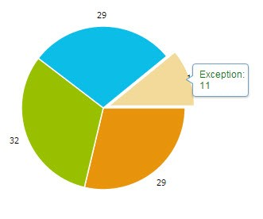
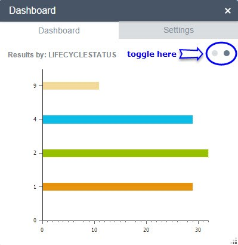
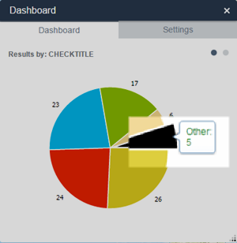
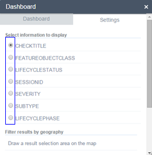
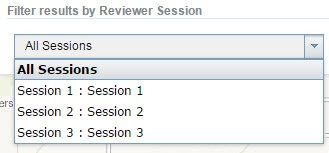

# Reviewer Dashboard widget
The Reviewer Dashboard widget for Web AppBuilder works with the ArcGIS Data Reviewer for Server extension.

The Dashboard widget displays data quality result statistics as infographics—pie and bar charts—to summarize data quality issues identified in your GIS data. The statistics represent total counts of results summarized by a field that allows you to understand the number and type of results present in your data.

The widget supports both spatial and attribute-based filtering of results. This allows you to visualize result statistics by a specific area and attribute. You can spatially filter results by:
* current map extent 
* selection area drawn on the map
* selected features in a polygon map service layer

By default there are seven (7) fields by which the Reviewer results can be summarized and filtered. These fields include the following: 
* CHECKTITLE
* FEATUREOBJECTCLASS
* LIFECYCLEPHASE
* LIFECYCLESTATUS
* SESSIONID
* SEVERITY
* SUBTYPE

If there are custom fields defined for your results, they will automatically be added to the fields’ summary list. Information on how to create custom fields for your results can be found here.

## Sections

* [Features](#features)
* [Requirements](#requirements)
* [Instructions](#instructions)
* [Configuring the Reviewer Dashboard widget](#Configuring the Reviewer Dashboard widget)
* [Using the Reviewer Dashboard widget](#using)
* [Resources](#resources)
* [Issues](#issues)
* [Contributing](#contributing)
* [Licensing](#licensing)

## Features
* Display data quality result statistics as infographics
* Apply spatial and attribute-based filtering of results

## Requirements
Requires Web AppBuilder for ArcGIS version 1.2

## Instructions
Deploying Widgets.

To use the widgets with you should copy any of the widgets to the stemapp/widget directory. This is located in %webappbuilder_install%/client directory.

For more resources on developing modifying widgets please visit
[Web AppBuilder for ArcGIS Documentation](http://doc.arcgis.com/en/web-appbuilder/)

##Configuring the Reviewer Dashboard widget

Use Web AppBuilder for ArcGIS to configure the Reviewer Dashboard Widget.

1.	Click the pen in the corner of the Reviewer Dashboard icon to begin a configuration session.
2.	To change the icon, click the **change widget** icon button and replace it with your own image. A file explorer window opens, allowing you to select a local image file to use as the widget icon.
3.	Provide the Data Reviewer for Server SOE URL, then click **Set**.
4.	Type the number of segments to display in the pie chart graphical representation of results summaries.   
   **Note**: The maximum number of segments is 10 and the default is 5. If there are more than 10, a category called **Other** will contain the additional results data and will display in the drill-down view.
5.	The **Include filter by geography** checkbox is selected by default in the widget. 
  1.	If you want to keep the default setting and filter by geography, either enter a new URL in the **Service for filter by geography** text box for the map service, or keep the current (default) URL. 
  2.	Since the map service must contain a polygon layer to filter Reviewer results, enter the layer in the **Service layer for filter by geography** text box.
  3.	Provide a URL to a geometry service in the **Geometry service URL** text box.
  4.	Alternatively, you remove the filtering by geography behavior completely from the widget by unchecking the **Include filter by geography** check box.
6.	To have the pie chart open with a certain field, click the radio button in the **Default** column that corresponds to the Dashboard Field Name, then click OK.
7.	To set the visibility of a field, use the checkbox in the **Visible** column next to its **Dashboard Field Name**.
8.	To set the **Field Name Alias**, use the **Alias** column and double-click the current name, then make your edit.
9.	Click **OK** to save and close the Reviewer Dashboard widget configuration.

##Using the Reviewer Dashboard widget
###**Dashboard Tab**   
The widget opens with a graphical representation of Dashboard Results with the selected default field displaying. Hover over a segment in the pie chart to view additional details about each attribute property.

You can toggle between two different visualizations of results’ summaries:
* Pie chart
* Bar graph

Pie Chart – Other Category   
Click on Other to refresh the pie chart to display segments that are greater than the default value set in the original configuration.

###**Settings Tab**   
To view results by a different field, select the radio button next to the Field Name you want to view.

**Filter Results by Geography**   
You can filter the overall results by geometry in one of four ways:

1. **Draw a selection area on the map**—restrains display to results found only within that selection.
2. **Show results in the current map extent**—chart will update to display summarized results in the current map view.
3. **Show results for the Census Block Group**—when you click on a census block in the map, the chart will update to display summarized results within that block.
4. **Use no spatial filter**—clears any spatial filter previously applied to the chart.

**Filter Results by Session**   
Under the **Settings** tab, you can also filter results by Reviewer Session. Use the drop-down to select either **All Sessions** or the specific session you are interested in viewing from the list of available sessions.

## Resources

## Issues
* Find a bug or want to request a new feature?  Please let us know by submitting an issue.

## Contributing
Esri welcomes contributions from anyone and everyone. Please see our [guidelines for contributing](https://github.com/esri/contributing).

## Licensing
Copyright 2013 Esri

Licensed under the Apache License, Version 2.0 (the "License");
you may not use this file except in compliance with the License.
You may obtain a copy of the License at

   http://www.apache.org/licenses/LICENSE-2.0

Unless required by applicable law or agreed to in writing, software
distributed under the License is distributed on an "AS IS" BASIS,
WITHOUT WARRANTIES OR CONDITIONS OF ANY KIND, either express or implied.
See the License for the specific language governing permissions and
limitations under the License.

A copy of the license is available in the repository's
[license.txt](../LICENSE) file.

